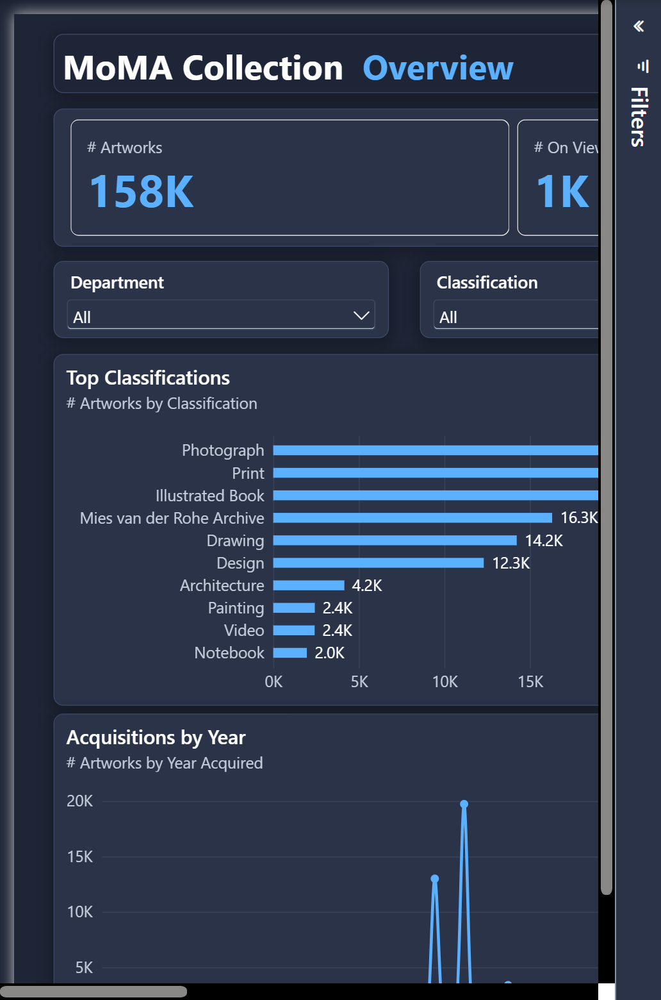
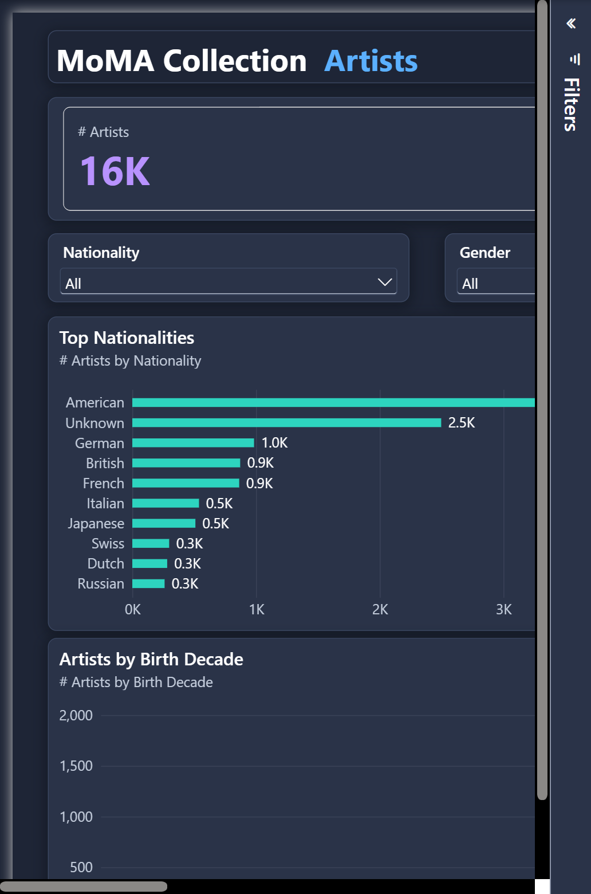
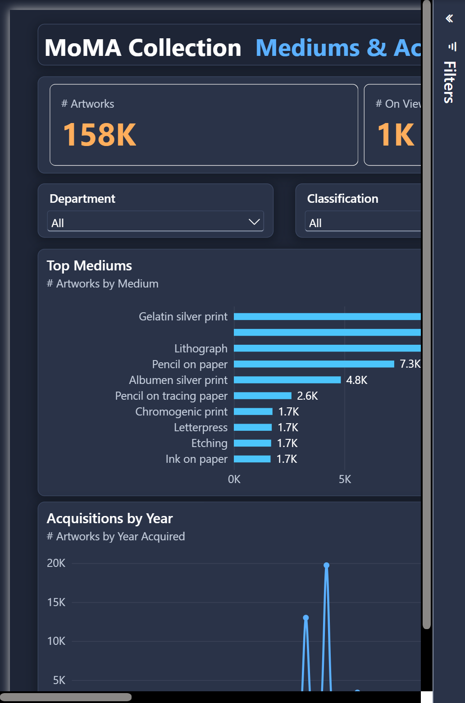

# Modern Art Collection — Power BI Dashboard

An interactive Power BI dashboard exploring **The Museum of Modern Art (MoMA)** collection —
~158,000 artworks and ~16,000 artists — built as an **educational project** in data cleaning
and dashboard design.

The dataset is cleaned entirely in **Power Query (M)**, modeled in a **Power BI semantic model
(TMDL)**, and visualized with native Power BI report visuals on a custom dark theme.

## Pages

| Page | What it shows |
|------|----------------|
| **Collection Overview** | KPIs (# Artworks, On View, % On View, # Artists), top classifications, artworks by decade, acquisitions over time, and by department |
| **Artists** | Artist counts (total / living), top nationalities, gender split, birth-decade distribution, and a nationality breakdown table |
| **Mediums & Acquisitions** | Top mediums, most-collected artists, acquisitions over time, and works by artist gender |

Each page has cross-filtering slicers (Department, Classification, Decade, and more).

| Artists | Mediums & Acquisitions |
|---|---|
|  |  |

## Data source & credit

Data comes from MoMA's official open-data release, published as **CC0 (public domain)**:
- 🔗 https://github.com/MuseumofModernArt/collection

Files used: `Artworks.csv` and `Artists.csv`. This project is **not affiliated with or endorsed
by MoMA**; it uses their public data for educational purposes.

## How to open

### Option A — quick view (`.pbix`)
Download the `.pbix` from the [Releases](../../releases) page and open it in
[Power BI Desktop](https://powerbi.microsoft.com/desktop/) (free). No setup needed — it already
contains a data snapshot.

### Option B — the full project (`.pbip`)
1. Install the latest **Power BI Desktop**.
2. Enable PBIP: *File → Options → Preview features → "Power BI Project (.pbip) save option"*.
3. Open `artworks.pbip`.

> **⚠️ Fix the data path before refreshing.** The query points to a local CSV path. Open
> *Transform data → Advanced Editor* on the `Artworks` / `Artists` queries and update the
> `File.Contents("...")` path to where you saved the CSVs (download them from the link above).

## How the data was cleaned (Power Query highlights)

- Trimmed text and filled blank categories (`Unclassified`, `Unassigned`) so charts have no empty axis members
- Extracted **Primary Nationality** from the raw parenthesized artist bio
- Normalized **Artist Gender** to Male / Female / Non-binary–Other / Unknown
- Parsed a four-digit **Year Created** out of free-text dates, then derived **Decade Created**
- Derived **Year Acquired** from the acquisition date
- Flagged **On View** and readable **Cataloged Status**

## Rebuilding the report visuals

The report pages are generated deterministically by `build_report.py`, which writes the PBIR
`visual.json` files (theme, layout, KPIs, slicers, and charts). Run it, then reload Power BI Desktop.

## Tech

Power BI Desktop · Power Query (M) · TMDL semantic model · PBIR (Power BI Project) · Python (visual generation)

## License

- **Code & report** (this repo): [MIT](LICENSE)
- **MoMA data**: CC0 1.0 (public domain), © The Museum of Modern Art
